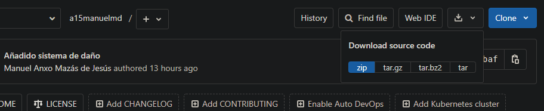
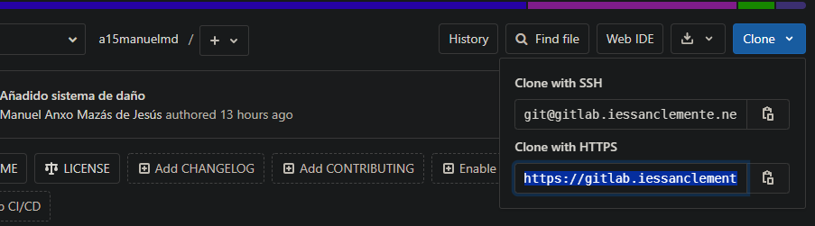
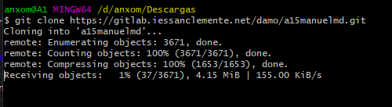
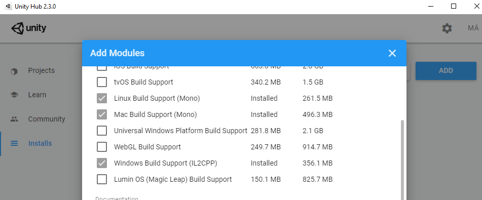
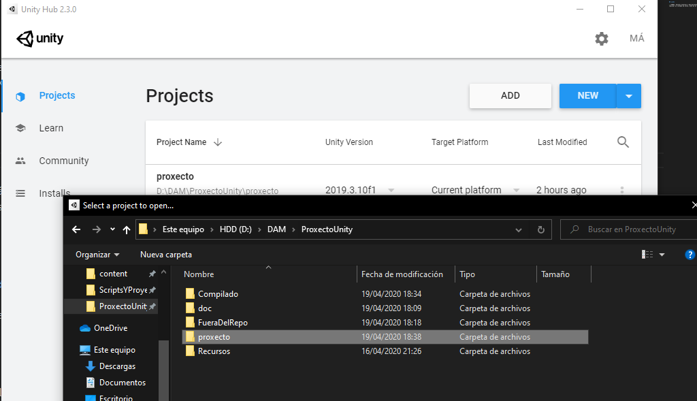
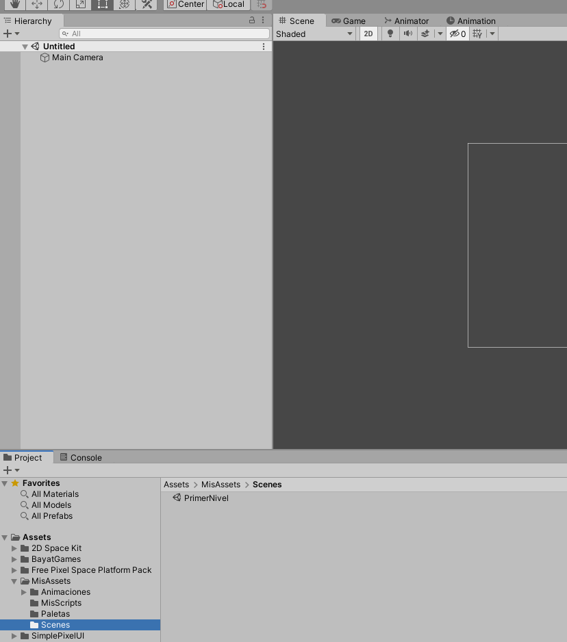
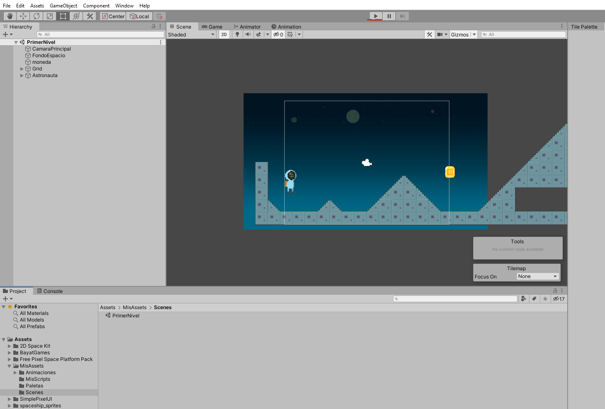
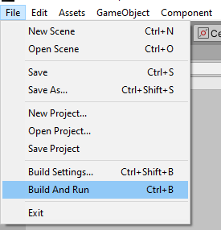

# Proyecto Espacio Hostil

## Descripción

Este proyecto consiste en un videojuego de plataformas en 2D de temática espacial programado en unity y C#.

## Instalación / Puesta en marcha

> Para poder usar probar el videojuego, **lo más fácil es ejecutarlo directamente de la carpeta *Compilado***. En esta carpeta es en donde dejo las builds del videojuego(inicialmente solo para windows, pero posteriormente estará disponible para mac y linux).

**Si se prefiere, se puede compilar directamente desde Unity.**

## Descargar el repositorio:

> Para descargar el repositorio. Puedes hacer clic en descargar.
> 
> 
> 
> También desde una terminal con el comando git clone(en linux suele estar preintalado git), en caso de usar windows puedes usar [este programa.](https://gitforwindows.org/)
>
> Copiamos la dirección https del repo.
> 
> 
>
> En la terminal, escribimos git clone "direccion http" "nombre de la carpeta donde se guarda"(si no se especifica un nombre, lo guarda en "a15manuelmd").
> 
> 

## Pasos necesarios:

> 1º Tener instalado Unity y los siguientes módulos

> 2º En la pestaña *Projects* añadimos la carpeta  *proxecto* (está dentro del repo que descargamos anteriormente). Esto tardará un rato, porque tiene que añadir las librerías (usa las estándar de Unity).

> 3º Tras abrir el proyecto, abrimos el archivo *PrimerNivel* que se encuentra en la ruta **/MisAssets/Scenes/**(dentro de scenes están los "escenarios/niveles" del juego con todo ya configurado). Tras hacer esto, ya se puede ejecutar en el botón *"Play"* de la parte superior.

> 4º Para compilar el videojuego en el menú *File* seleccionamos *Build And Run*, esto nos abrirá una ventana preguntándonos donde guardar el juego compilado.
Tras guardarlo en donde queramos, este se abrirá automáticamente. Si queremos abrirlo de nuevo ejecutamos el archivo **Espacio Hostil.exe**.

## Uso

Al tratarse de un videojuego, solo tienes que pulsar jugar e intentar avanzar por la derecha sin morir.

## Sobre el autor

**Breve descripción:** Apasionado de las nuevas tecnologías, y siempre buscando una forma de tener más libertad y control sobre todo lo que manipulo, tanto sea una tostadora como mi ordenador personal.

Para mí programar es como un puzzle, sabes cual tiene que ser el resultado final, tienes un conjunto de piezas y solo las tienes que colocar en el orden correcto para que todo funcione.

**Formación:** Titulado en ASIR y pronto DAM

**Contacto:** a15manuelmd@iessanclemente.net

## Licencia

Copyright (C)  2020  Manuel Ángel Mazás De Jesús.
Permission is granted to copy, distribute and/or modify this document
under the terms of the GNU Free Documentation License, Version 1.3
or any later version published by the Free Software Foundation;
with no Invariant Sections, no Front-Cover Texts, and no Back-Cover Texts.
A copy of the license is included in the section entitled "GNU
Free Documentation License".

## Índice

1. [Idea](doc/templates/1_idea.md)
2. [Necesidades](doc/templates/2_necesidades.md)
3. [Análisis](doc/templates/3_analise.md)
4. [Diseño](doc/templates/4_deseño.md)
5. [Planificación](doc/templates/5_planificacion.md)
6. [Implantación](doc/templates/6_implantacion.md)
7. [Manual VideoJuego](doc/documantaciónXogo/DocXogo.md)

## Guía de contribución

Actualmente, la mejor forma de contribuir, sería con nuevas *texturas, modelos, sonidos*. Puesto que carezco de los medios y de la experiencia para crear contenido audiovisual adecuado.

Por otro lado, siempre se aceptan mejoras del código existente o nuevas funcionalidades que considere acertadas para el proyecto.

Para hacer contribuciones, simplemente haz un push con las mejores que consideres o contáctame por correo con el encabezado **"Propuesta: tu propuesta"**

Si encuentras algún problema, no dudes en hacérmelo saber [aquí.](https://gitlab.iessanclemente.net/damo/a15manuelmd/issues/new)

> Para bugs en el juego pon de título "bug" seguido por a que aspecto afecta(sonido, vídeo, movimiento, rendimiento....)

* Es necesario describir en que consiste el bug(en que medida nos afecta).
* En que sistema operativo y versión del mismo se ha producido.
* Que versión del juego estas ejecutando.
* Forma de reproducir el bug.
* Alguna captura o enlace a un vídeo en el que se pueda apreciar el problema.

## Links

*Unity:* https://unity.com/es
